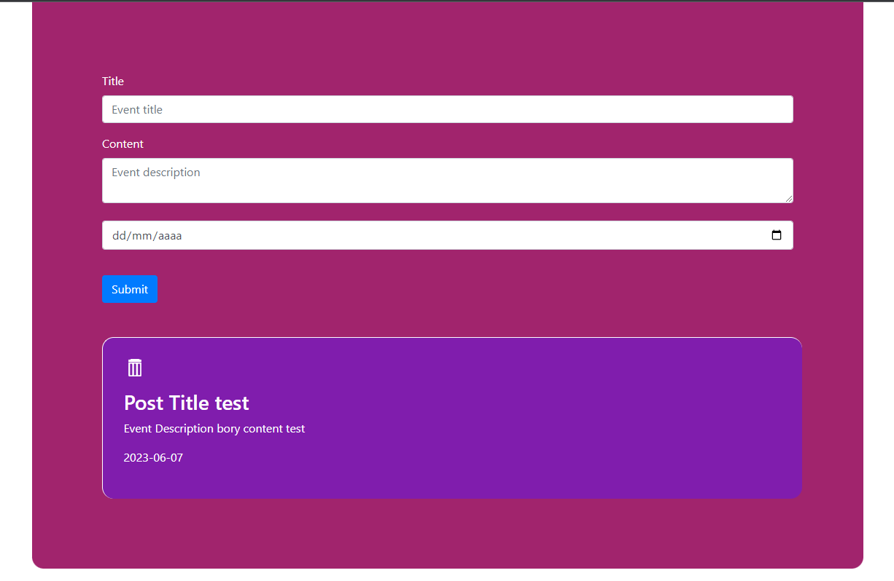

<!-- PROJECT LOGO -->
<br />
<div align="center">
  <h2 align="center">WDDM - 124 - Coding Challenge</h3>
  <h3 align="center">Humber College</h3>

  <p align="center">
    API server and frontend (HTML/CSS/Js)!
  </p>
  <p alight="center">
    Creator: Gabriel Lucas Bispo da Rocha
  </p>
  
</div>


<!-- TABLE OF CONTENTS -->
<details>
  <summary>Table of Contents</summary>
  <ol>
    <li>
      <a href="#about-the-project">About The Project</a>
    </li>
    <li>
      <a href="#getting-started">Getting Started</a>
      <ul>
        <li><a href="#prerequisites">Prerequisites</a></li>
        <li><a href="#installation">Installation</a></li>
      </ul>
    </li>
    <li>
      <a href="#Contact">Contact</a>
    </li>
  </ol>
</details>



<!-- ABOUT THE PROJECT -->
## About The Project

This project is a coding challenge for professor Cory Coletta at Humbber College for Employ and Portf Design - WDDM - 124 - IGA.
The project consists in a api and an application that can access it.
The api was build using Node.js, express and cors as dependencies.

Here you will find a project of a event api. The interface have a form that you can create and see the events you added previously.
The data is beein saved in runtime, there is no database implemented.


<p align="right">(<a href="#readme-top">back to top</a>)</p>


<!-- GETTING STARTED -->
## Getting Started

Here follows the instructions to run this project in your pc.

### Prerequisites

* Node.js
* npm
* vsCode
* liveServer Extension

### Installation

1. Clone the repo
   ```sh
   git clone https://github.com/XDYuuki/wddm-124-code-challenge
   ```
3. Install NPM packages
   ```sh
   npm install
   ```
4. Run api server
   ```sh
   cd wddm-124-code-challenge/api/
   npm start
   ```
5. run index.html with liveServer VSCode extension.

<p align="right">(<a href="#readme-top">back to top</a>)</p>


<!-- CONTACT -->
## Contact

Gabriel Rocha - [@gabriellbr](https://www.linkedin.com/in/gabriellbr/) - gabriel.lbr@outlook.com

Project Link: [https://github.com/XDYuuki/wddm-124-code-challenge.git](https://github.com/XDYuuki/wddm-124-code-challenge.git)

<p align="right">(<a href="#readme-top">back to top</a>)</p>


[linkedin-url]: https://www.linkedin.com/in/gabriellbr/
[Bootstrap-url]: https://getbootstrap.com
[Node.js-url]: https://nodejs.org/en
